## **Section 04: Orchestrating Collections of Services with Kubernetes**

## Table of Contents
- [**Section 04: Orchestrating Collections of Services with Kubernetes**](#section-04-orchestrating-collections-of-services-with-kubernetes)
- [Table of Contents](#table-of-contents)
  - [Configuration Linux](#configuration-linux)
  - [A Kubernetes Tour](#a-kubernetes-tour)
  - [Important Kubernetes Terminology](#important-kubernetes-terminology)
  - [Notes on Config Files](#notes-on-config-files)
  - [Creating a Pod](#creating-a-pod)
  - [Understanding a Pod Spec](#understanding-a-pod-spec)
  - [Common Kubectl Commands](#common-kubectl-commands)
  - [Introducing Deployments](#introducing-deployments)
  - [Creating a Deployment](#creating-a-deployment)
  - [Common Commands Around Deployments](#common-commands-around-deployments)
  - [Updating Deployments](#updating-deployments)
  - [Preferred Method for Updating Deployments](#preferred-method-for-updating-deployments)
  - [Networking With Services](#networking-with-services)
  - [Creating a NodePort Service](#creating-a-nodeport-service)
  - [Accessing NodePort Services](#accessing-nodeport-services)
  - [Setting Up Cluster IP Services](#setting-up-cluster-ip-services)
  - [Building a Deployment for the Event Bus](#building-a-deployment-for-the-event-bus)
  - [Adding ClusterIP Services](#adding-clusterip-services)
  - [How to Communicate Between Services](#how-to-communicate-between-services)
  - [Updating Service Addresses](#updating-service-addresses)
  - [Verifying Communication](#verifying-communication)
  - [Adding Query, Moderation and Comments](#adding-query-moderation-and-comments)
  - [Testing Communication](#testing-communication)
  - [Load Balancer Services](#load-balancer-services)
  - [Load Balancers and Ingress](#load-balancers-and-ingress)
  - [Installing Ingress-Nginx](#installing-ingress-nginx)
  - [Writing Ingress Config Files](#writing-ingress-config-files)
  - [Hosts File Tweak](#hosts-file-tweak)
  - [Quick Note](#quick-note)
  - [Deploying the React App](#deploying-the-react-app)
  - [Unique Route Paths](#unique-route-paths)
  - [Final Route Config](#final-route-config)
  - [Introducing Skaffold](#introducing-skaffold)
  - [Skaffold Setup](#skaffold-setup)
  - [First Time Skaffold Startup](#first-time-skaffold-startup)
  - [A Few Notes on Skaffold](#a-few-notes-on-skaffold)

### Configuration Linux

Why we need it ?
[minikube problem](minikubeproblem.md)
```console
   eval $(minikube docker-env)

```

> create alias for a easy access to kublet

```console
   vim ~/.bashrc
  
    alias k="kubectl"
```


**[⬆ back to top](#table-of-contents)**

### A Kubernetes Tour

```console
kubectl version
```

Create Docker Image

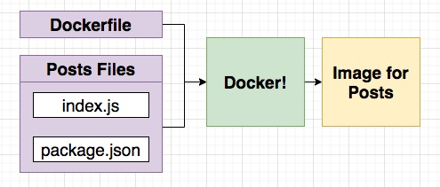

Kubernetes Cluster

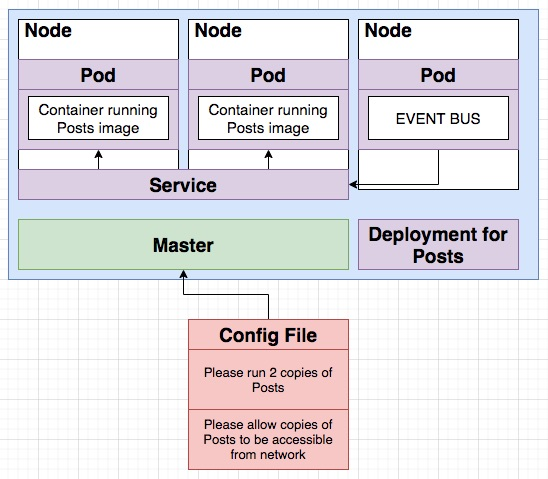

**[⬆ back to top](#table-of-contents)**

### Important Kubernetes Terminology

| Keyword            | Meaning                                                                                              |
| ------------------ | ---------------------------------------------------------------------------------------------------- |
| Kubernetes Cluster | A collections of nodes + a master to manage them                                                     |
| Node               | A virtual machine that will run our containers                                                       |
| Pod                | More or less a running container.  Technically, a pod can run multiple containers (we won't do this) |
| Deployment         | Monitors a set of pods, make sure they are running and restarts them if they crash                   |
| Service            | Provides an easy-to-remember URL to access a running container                                       |

**[⬆ back to top](#table-of-contents)**

### Notes on Config Files

- Tells Kubernetes about the different Deployments, Pods, and Services (referred to as 'Objects') that we want to create
- Written in YAML syntax
- Always store these files with our project source code - they are documentation!
- We can create Objects without config files - do not do this.  Config files provide a precise definition of what your cluster is running.
  - Kubernetes docs will tell you to run direct commands to create objects - only do this for testing purposes
  - Blog posts will tell you to run direct commands to create objects - close the blog post!

**[⬆ back to top](#table-of-contents)**

### Creating a Pod

```yaml
apiVersion: v1
kind: Pod
metadata:
  name: posts
spec:
  containers:
    - name: posts
      image: leonardo/posts:0.0.1
      imagePullPolicy: Never # local image
```

```console
cd seccion-04/post/
docker build -t leonardo/posts:0.0.1 .
cd ../infra/k8s/
kubectl apply -f post.yaml
kubectl get pods
```

**[⬆ back to top](#table-of-contents)**

### Understanding a Pod Spec

| Configuration Parameters       | Notes                                                                                                               |
| ------------------------------ | ------------------------------------------------------------------------------------------------------------------- |
| apiVersion: v1                 | K8s is extensible - we can add in our own custom objects.  This specifies the set of objects we want K8s to look at |
| kind: Pod                      | The type of object we want to create                                                                                |
| metadata:                      | Config options for the object we are about to create                                                                |
| name: posts                    | When the pod is created, give it a name of 'posts'                                                                  |
| spec:                          | The exact attributes we want to apply to the object we are about to create                                          |
| containers:                    | We can create many containers in a single pod                                                                       |
| - name: posts                  | Make a container with a name of 'posts'                                                                             |
| image: leonardo/posts:0.0.1    | The exact image we want to use                                                                                      |

**[⬆ back to top](#table-of-contents)**

### Common Kubectl Commands

| Docker World                         | K8s World                         |
| ------------------------------------ | --------------------------------- |
| docker ps                            | kubectl get pods                  |
| docker exec -it [container id] [cmd] | kubectl exec -it [pod_name] [cmd] |
| docker logs [container id]           | kubectl logs [pod_name]           |

| K8s Commands                        | Explanation                                         |
| ----------------------------------- | --------------------------------------------------- |
| kubectl get pods                    | Print out information about all of the running pods |
| kubectl exec -it [pod_name] [cmd]   | Execute the given command in a running pod          |
| kubectl logs [pod_name]             | Print out logs from the given pod                   |
| kubectl delete pod [pod_name]       | Deletes the given pod                               |
| kubectl apply -f [config file name] | Tells kubernetes to process the config              |
| kubectl describe pod [pod_name]     | Print out some information about the running pod    |

```console
cd seccion-04/infra/k8s/
kubectl apply -f post.yaml
kubectl get pods
kubectl exec -it posts sh
kubectl logs posts
kubectl delete pod posts
kubectl get pods
kubectl apply -f posts.yaml
kubectl get pods
kubectl describe pod posts
```

**[⬆ back to top](#table-of-contents)**

### Introducing Deployments

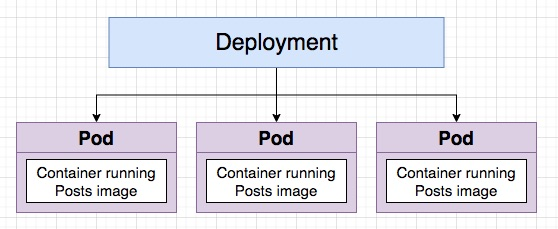

**[⬆ back to top](#table-of-contents)**

### Creating a Deployment

Whenever I create a kubernetes deployment,  it will auto download image from docker hub?

- It depends on the ImagePullPolicy of the Pod
- The default pull policy is IfNotPresent
- It will try to download the image if it’s not already present on the node
- If your image is qualified with a custom registry it will try to download it from this custom registry and may use an imagePullSecret to do so
- Refer to [Images](https://kubernetes.io/docs/concepts/containers/images/) for more info.

```yaml
apiVersion: apps/v1
kind: Deployment
metadata:
  name: posts-depl
spec:
  replicas: 1
  selector:
    matchLabels:
      app: posts
  template:
    metadata:
      labels:
        app: posts
    spec:
      containers:
        - name: posts
          image: leonardo/posts:0.0.1
```

```console
cd seccion-04/infra/k8s/
kubectl apply -f post-deployment.yaml
```

**[⬆ back to top](#table-of-contents)**

### Common Commands Around Deployments

| Deployment Commands                            | Explanation                                                                                                      |
| ---------------------------------------------- | ---------------------------------------------------------------------------------------------------------------- |
| kubectl get deployments                        | List all the running deployments                                                                                 |
| kubectl describe deployment [depl name]        | Print out details about a specific deployment                                                                    |
| kubectl apply -f [config file name]            | Create a deployment out of a config file                                                                         |
| kubectl delete deployment [depl_name]          | Delete a deployment                                                                                              |
| kubectl rollout restart deployment [depl_name] | Get a deployment to restart all pods.  Will use latest version of an image if the pod spec has a tag of 'latest' |

```console
cd seccion-04/infra/k8s/
kubectl get deployments
kubectl get pods
kubectl delete pods posts-depl-xxxxxxxxx-xxxx
kubectl describe deployment posts-depl
kubectl delete deployment posts-depl
kubectl apply -f post-deployment.yaml
kubectl get deployments
kubectl get pods
```

**[⬆ back to top](#table-of-contents)**

### Updating Deployments

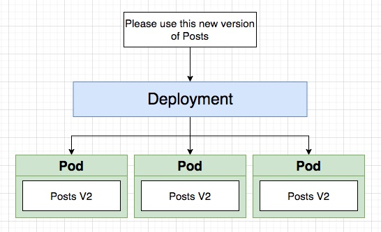

> class 74

Updating the Image Used By a Deployment - Method #1

- Step 1 - Make a change to your project code
- Step 2 - Rebuild the image, specifying a new image version
```console
cd seccion-04/post/
docker build -t leonardo/posts:0.0.5 .
```
- Step 3 - In the deployment config file, update the version of the image
- Step 4 - Run the command: kubectl apply -f [depl file name]
```console
cd ../infra/k8s
kubectl apply -f post-deployment.yaml
kubectl get deployments
kubectl get pods
kubectl logs posts-depl-xxxxxxxxx-xxxx
```

**[⬆ back to top](#table-of-contents)**

### Preferred Method for Updating Deployments

Updating the Image Used By a Deployment - Method #2

- Step 1 - The deployment must be using the 'latest' tag in the pod spec section
  - image: leonardo/posts:latest or 
  - image: leonardo/posts
```console
cd seccion-04/infra/k8s
kubectl apply -f posts-depleployment.yaml
kubectl get deployments
```
- Step 2 - Make an update to your code
- Step 3 - Build the image
```console
cd seccion-04/post
docker build -t leonardo/posts .
```
- Step 4 - Push the image to docker hub
```console
docker login
docker push leonardo/posts
```
[leonardo/posts
](https://hub.docker.com/r/leonardo/posts)
- Step 5 - Run the command: kubectl rollout restart deployment [depl_name]
```console
kubectl get deployments
kubectl rollout restart deployment posts-depl
kubectl get deployments
kubectl get pods
kubectl logs posts-depl-6947b4f9c-t5zx5
```

**[⬆ back to top](#table-of-contents)**

### Networking With Services

```console
kubectl get pods
kubectl logs posts-depl-6947b4f9c-t5zx5
```

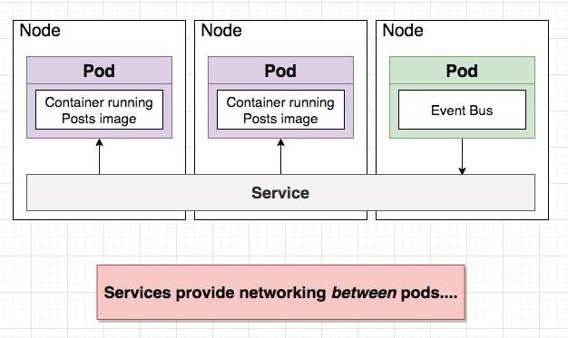
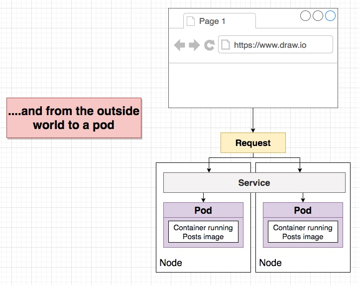

| Types of Services | Explanation                                                                                                  |
| ----------------- | ------------------------------------------------------------------------------------------------------------ |
| Cluster IP        | Sets up an easy-to-remember URL to access a pod. Only exposes pods in the cluster                            |
| Node Port         | Makes a pod accessible from outside the cluster.  Usually only used for dev purposes                         |
| Load Balancer     | Makes a pod accessible from outside the cluster.  This is the right way to expose a pod to the outside world |
| External Name     | Redirects an in-cluster request to a CNAME url.....don't worry about this one....                            |

Cluster IP - node to node communication

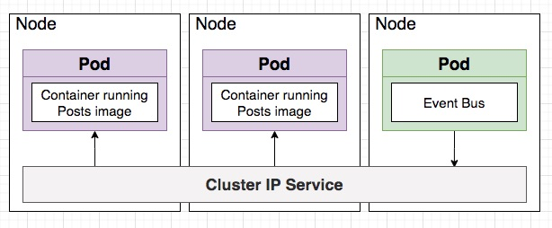

Makes a pod accessible from outside the cluster (outside to node communication)

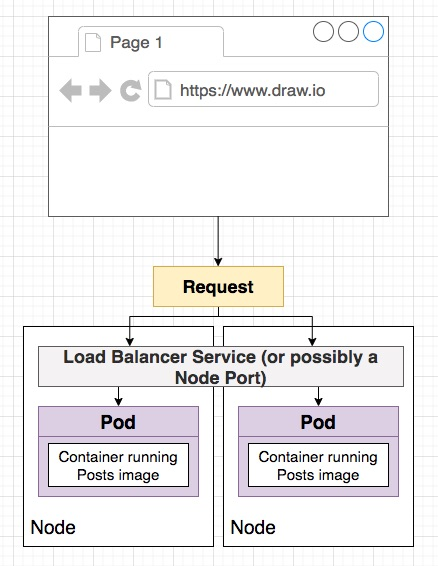

**[⬆ back to top](#table-of-contents)**

### Creating a NodePort Service

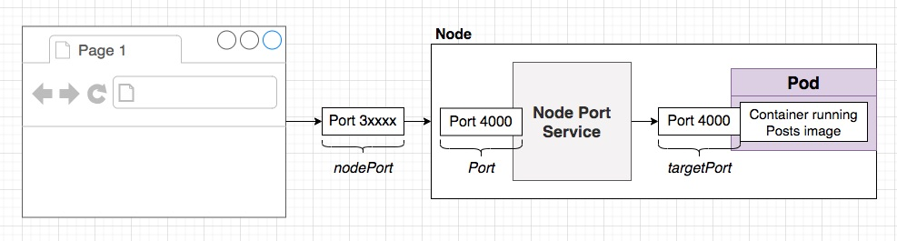

```yaml
apiVersion: v1
kind: Service
metadata:
  name: posts-srv
spec:
  type: NodePort
  selector:
    app: posts
  ports:
    - name: posts
      protocol: TCP
      port: 4000
      targetPort: 4000
```

**[⬆ back to top](#table-of-contents)**

### Accessing NodePort Services

```console
cd seccion-04/infra/k8s/
kubectl apply -f post-srv.yaml
kubectl get services
kubectl describe service posts-srv
```

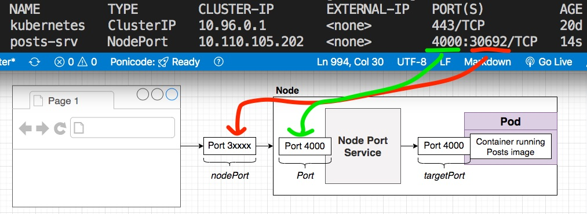
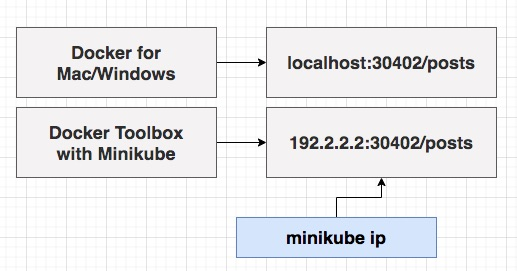

```console
kubectl get pods
kubectl get svc -A
curl localhost:30692/posts
```

Error 
- curl: (7) Failed to connect to localhost port 30692: Connection refused

How to troubleshoot?

### LINUX[Fedora]: solved problem nf_conntrack_max

in fedora 34 there is an error in kube-system's pod
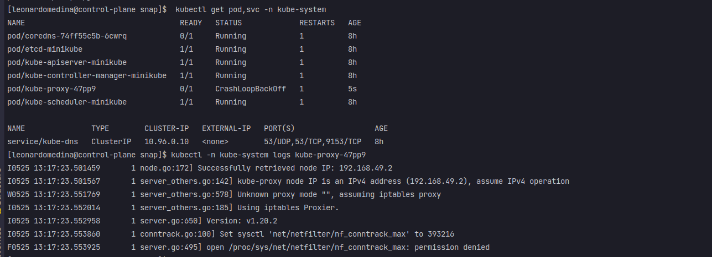

```console
 kubectl get pod,svc -n kube-system
 kubectl -n kube-system logs kube-proxy-47pp9
```
> the problem here is that pod want to change a file nf_conntrack_max without permissions, to solve this I found in a kubernetes-github issues
[Ticket-solved](https://github.com/kubernetes-sigs/kind/issues/2240#issuecomment-847044226) the author said:

1. Delete your local cluster first
   
`minikube delete`

2. Set sudo sysctl net/netfilter/nf_conntrack_max=393216, `NOTICE the above image, the max value that tried to change is 393216, it's important to set the same value`
3. Start a new local cluster again
   `minikube start`


#1: Test to check if your container expose your app on http://localhost:4000 ?

```console
kubectl exec -it posts-depl-6947b4f9c-qbn4h sh
/app # apk add curl
/app # curl localhost:4000/posts
/app # curl http://posts-srv:4000/posts
```

#2: Test to check if your kubernetes service is ok ?

```console
kubectl exec -it posts-depl-6947b4f9c-qbn4h sh
/app # apk add curl
/app # curl http://posts-srv:4000/posts
```

#3: Check if the problem is coming from [kube-proxy](https://kubernetes.io/docs/reference/command-line-tools-reference/kube-proxy)?

```console
kubectl get pods -n kube-system
kubectl describe pod vpnkit-controller -n kube-system
```

The node was low on resource: ephemeral-storage. Container vpnkit-controller was using 84Ki, which exceeds its request of 0.

```console
NAME                                     READY   STATUS    RESTARTS   AGE
coredns-5644d7b6d9-b74mq                 1/1     Running   0          21d
coredns-5644d7b6d9-vrjfp                 1/1     Running   0          21d
etcd-docker-desktop                      1/1     Running   0          21d
kube-apiserver-docker-desktop            1/1     Running   0          21d
kube-controller-manager-docker-desktop   1/1     Running   0          21d
kube-proxy-k9wcv                         1/1     Running   0          21d
kube-scheduler-docker-desktop            1/1     Running   0          21d
storage-provisioner                      0/1     Evicted   0          21d
vpnkit-controller                        0/1     Evicted   0          21d
```

#4: Restart the evicted vpnkit-controller and storage-provisioner and resolve the docker-desktop bug

```console
<!-- check why vpnkit-controller is evicted? -->
kubectl describe pod vpnkit-controller -n kube-system
kubectl delete po storage-provisioner vpnkit-controller -n kube-system
```
- Disable and re-enable kubernetes integration (otherwise the pods are not being redeployed)
- If this doesn’t work, you can still hit the big red button “Reset Kubernetes Cluster” but you’ll have to redeploy your descriptors (deployment and service)

**[⬆ back to top](#table-of-contents)**

### Setting Up Cluster IP Services
> class 79
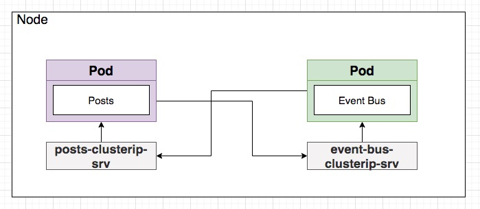

**[⬆ back to top](#table-of-contents)**

### Building a Deployment for the Event Bus

Goals Moving Forward

- Build an image for the Event Bus
```console
cd seccion-04/event-bus
docker build -t leonardo/event-bus .
```
- Push the image to Docker Hub or **local**
```console
cd seccion-04/event-bus
docker push leonardo/event-bus
```
  L O C A L
  [minikube env local](minikubeproblem.md)
```console
   eval $(minikube docker-env)
```
- Create a deployment for Event Bus
```console
cd ../infra/k8s/
kubectl apply -f event-bus-depl.yaml
kubectl get pods
kubectl logs event-bus-depl-5b575cf7cf-zf7zt 
```
- Create a Cluster IP service for Event Bus and Posts
- Wire it all up!

**[⬆ back to top](#table-of-contents)**

### Adding ClusterIP Services
> class 81
Go als Moving Forward

- Build an image for the Event Bus
- Push the image to Docker Hub
- Create a deployment for Event Bus
- Create a Cluster IP service for Event Bus and Posts
```console
cd seccion-04/infra/k8s/
kubectl apply -f event-bus-depl.yaml
kubectl apply -f post-deployment.yaml
kubectl get services
```
- Wire it all up!

**[⬆ back to top](#table-of-contents)**

### How to Communicate Between Services
> class 82

Goals Moving Forward

- Build an image for the Event Bus
- Push the image to Docker Hub
- Create a deployment for Event Bus
- Create a Cluster IP service for Event Bus and Posts
- Wire it all up!

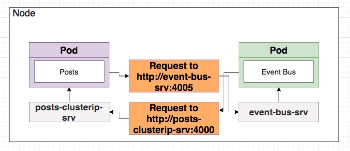


**[⬆ back to top](#table-of-contents)**

### Updating Service Addresses
> class 83

Updating the Image Used By a Deployment - Method #2

- Step 1 - The deployment must be using the 'latest' tag in 
- Step 2 - Make an update to your code
- Step 3 - Build the image
```console
cd seccion-04/event-bus
docker build -t leonardo/event-bus .
cd ../post
docker build -t leonardo/posts .
```
- Step 4 - Push the image to docker hub **[ for local image omit this ]**
```console
docker login
docker push leonardo/event-bus
cd ../post
docker push leonardo/posts
```
[leonardo/posts
](https://hub.docker.com/r/leone2015/posts)

[leonardo/event-bus
](https://hub.docker.com/r/leone2015/event-bus)
- Step 5 - Run the command: kubectl rollout restart deployment [depl_name]

> wherever path file (not important)

```console
kubectl get deployments
kubectl rollout restart deployment posts-depl
kubectl rollout restart deployment event-bus-depl
kubectl get deployments
kubectl get pods
kubectl logs posts-depl-6947b4f9c-t5zx5
```

**[⬆ back to top](#table-of-contents)**

### Verifying Communication

#1: Verifying Communication
```console
kubectl get pods
kubectl logs posts-depl-59f495469f-2zqmf
```

#2: Check if request can be send from posts pod to event-bus pod?
```console
kubectl get pods
kubectl exec -it posts-depl-59f495469f-2zqmf sh
/app # apk add curl
/app # curl http://event-bus-srv:4005/events
```

#3: Check if posts image is updated?
```console
kubectl get pods
kubectl exec -it posts-depl-6db458fb5c-q7khn -- cat index.js
```

#4: Docker Troubleshoot
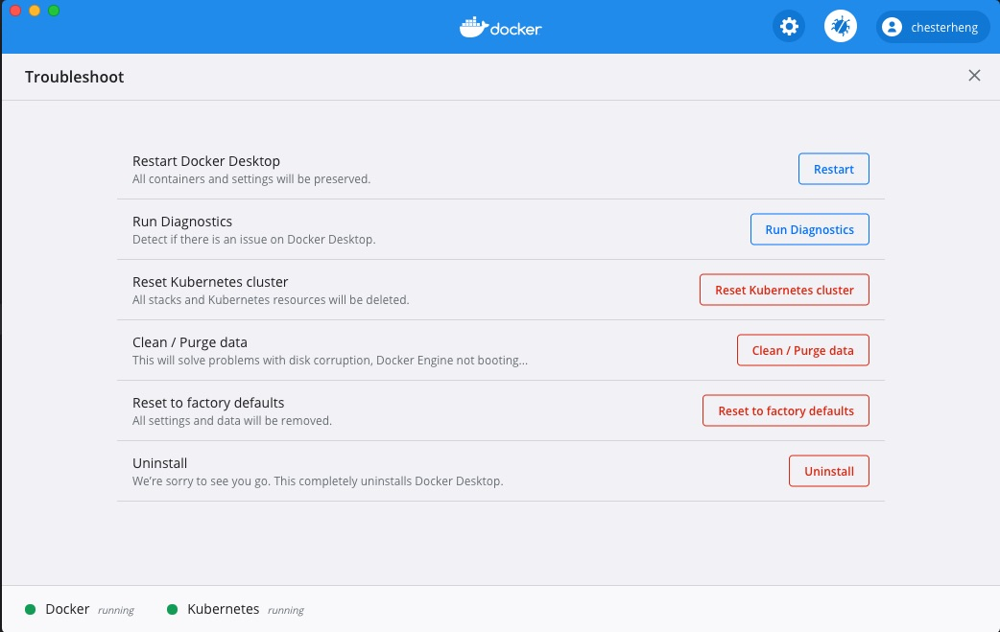

#5: Docker Troubleshoot

[netshoot](https://github.com/nicolaka/netshoot) 

- a Docker + Kubernetes network trouble-shooting swiss-army container

**[⬆ back to top](#table-of-contents)**

### Adding Query, Moderation and Comments

Adding More Services

- For 'comments', 'query', 'moderation'....
```console
kubectl get services
```
- Update the URL's in each to reach out to the 'event-bus-srv'
- Build images + push them to docker hub
```console
cd seccion-04/comments/
docker build -t leonardo/comments .
docker push leonardo/comments
```
```console
cd seccion-04/moderation/
docker build -t leonardo/moderation .
docker push leonardo/moderation
```
```console
cd seccion-04/query/
docker build -t leonardo/query .
docker push leonardo/query
```
- Create a deployment + clusterip service for each
```console
cd seccion-04/infra/k8s/
kubectl apply -f .
kubectl get pods
kubectl describe pod comments-depl-5ffc5697c8-j9sq6
kubectl exec -it comments-depl-5ffc5697c8-j9sq6 -- cat index.js
kubectl get services
```
- Update the event-bus to once again send events to 'comments', 'query', and 'moderation'

**[⬆ back to top](#table-of-contents)**

### Testing Communication

Adding More Services

- For 'comments', 'query', 'moderation'....
- Update the URL's in each to reach out to the 'event-bus-srv'
- Build images + push them to docker hub
- Create a deployment + clusterip service for each
- Update the event-bus to once again send events to 'comments', 'query', and 'moderation'
```console
kubectl get services
cd seccion-04/event-bus/
docker build -t leonardo/event-bus .
docker push leonardo/event-bus
kubectl rollout restart deployment event-bus-depl
kubectl get deployments
kubectl get pods
kubectl logs event-bus-depl-56f799cb77-f2h9v
kubectl describe pod event-bus-depl-56f799cb77-f2h9v
kubectl exec -it event-bus-depl-56f799cb77-f2h9v -- cat index.js
kubectl get services
```

**[⬆ back to top](#table-of-contents)**

### Load Balancer Services

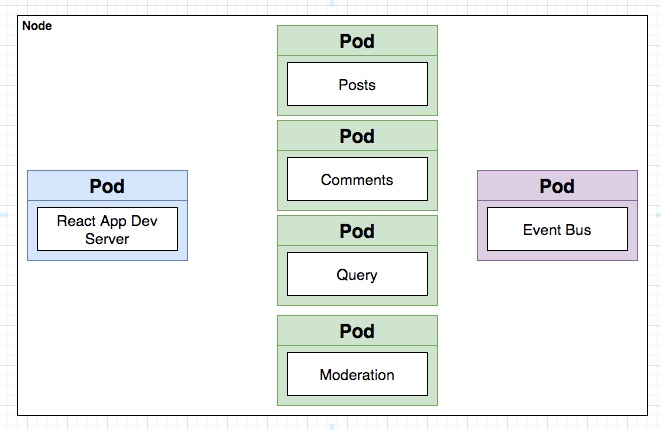
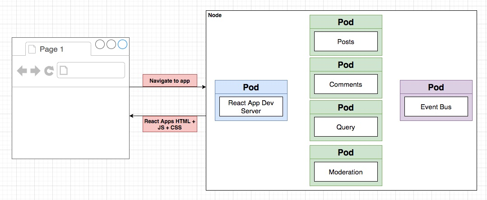
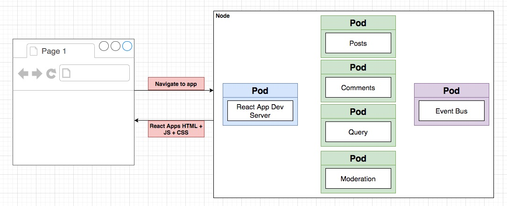
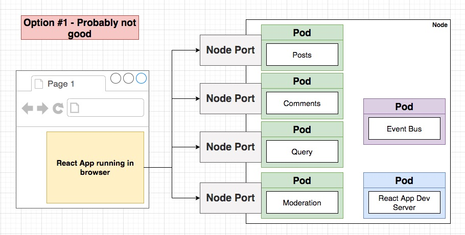
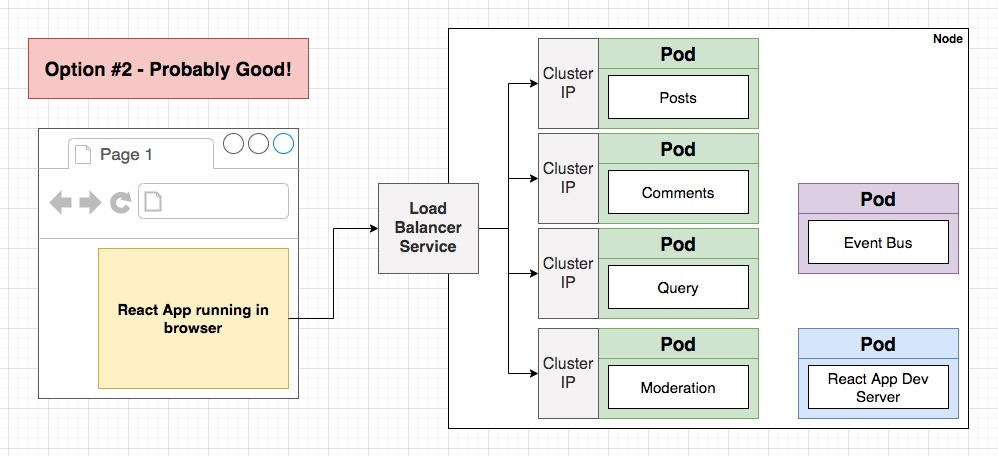

**[⬆ back to top](#table-of-contents)**

### Load Balancers and Ingress

Load Balancer Service

- Tells Kubernetes to reach out to its provider and provision a load balancer.  Gets traffic in to a single pod

Ingress or Ingress Controller

- A pod with a set of routing rules to distribute traffic to other services

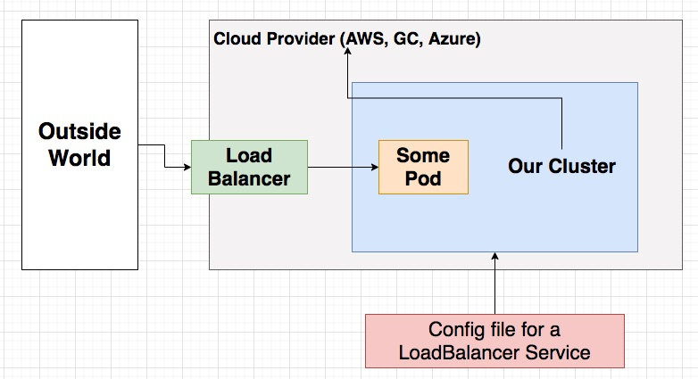
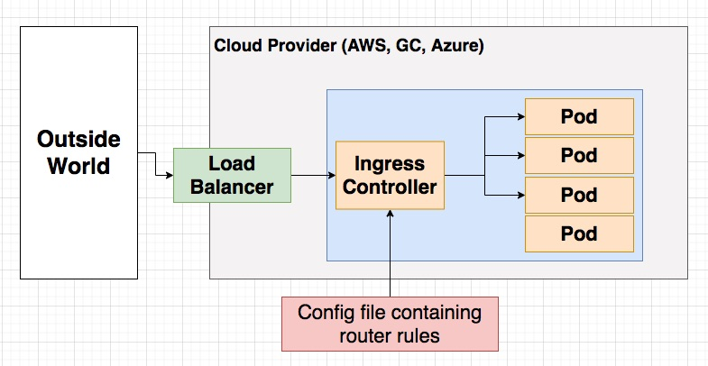

**[⬆ back to top](#table-of-contents)**

### Installing Ingress-Nginx

ingress-nginx
- Project that will create a Load Balancer Service + an Ingress for us
- We are using [ingress-nginx](https://github.com/kubernetes/ingress-nginx)
- There is another project that does the same thing with an almost identical name
  - [kubernetes-ingress](https://github.com/nginxinc/kubernetes-ingress)

[Installation Guide](https://kubernetes.github.io/ingress-nginx/deploy/)

```console
kubectl apply -f https://raw.githubusercontent.com/kubernetes/ingress-nginx/controller-v0.34.0/deploy/static/provider/cloud/deploy.yaml
```

**[⬆ back to top](#table-of-contents)**

### Writing Ingress Config Files


```console
cd seccion-04/infra/k8s/
kubectl apply -f ingress-srv.yaml
```

**[⬆ back to top](#table-of-contents)**

### Hosts File Tweak

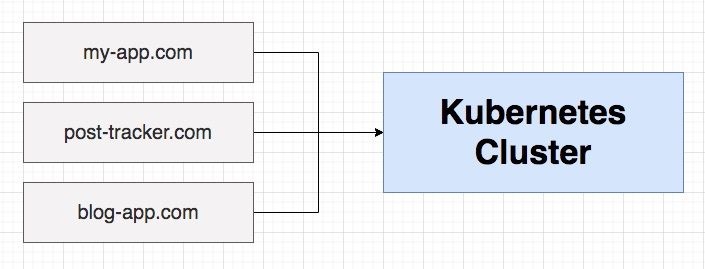

| OS          | Host File Location                    |
| ----------- | ------------------------------------- |
| Windows     | C:\Windows\System32\Drivers\etc\hosts |
| MacOS/Linux | /etc/hosts                            |

```console
code /etc/hosts
```

- Add 127.0.0.1 posts.com to /etc/hosts
- Try http://posts.com/posts

**[⬆ back to top](#table-of-contents)**

### Quick Note

[React-Scripts v3.4.1 fails to start in Docker](https://github.com/facebook/create-react-app/issues/8688)

**[⬆ back to top](#table-of-contents)**

### Deploying the React App

```console
cd seccion-04/client/
docker build -t leonardo/client .
docker push leonardo/client
cd ../infra/k8s/
kubectl apply -f client-depl.yaml
```

[Repositories](https://hub.docker.com/repositories)

**[⬆ back to top](#table-of-contents)**

### Unique Route Paths

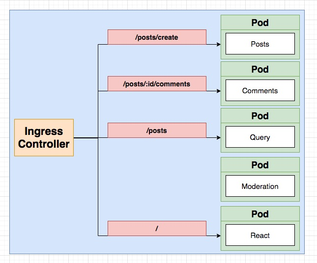

```console
cd seccion-04/client/
docker build -t leonardo/client .
docker push leonardo/client
kubectl rollout restart deployment client-depl
cd ../posts/
docker build -t leonardo/posts .
docker push leonardo/posts
kubectl rollout restart deployment posts-depl
```

**[⬆ back to top](#table-of-contents)**

### Final Route Config

```console
cd seccion-04/infra/k8s/
kubectl apply -f ingress-srv.yaml
kubectl get pod
```

**[⬆ back to top](#table-of-contents)**

### Introducing Skaffold

Skaffold

- Automates many tasks in a Kubernetes dev environment
- Makes it really easy to update code in a running pod
- Makes it really easy to create/delete all objects tied to a project at once
- [skaffold](skaffold.dev)

**[⬆ back to top](#table-of-contents)**

### Skaffold Setup

See blog/skaffold.yaml 

**[⬆ back to top](#table-of-contents)**

### First Time Skaffold Startup

```console
cd seccion-04/
skaffold dev
```
**[⬆ back to top](#table-of-contents)**

### A Few Notes on Skaffold

- Restart skaffold if encounter error message
- kubectl will remove all kubernetes objects when exit

```console
kubectl get pod
kubectl get deployments
kubectl get services
```

I keep running Skaffold over the last 2 days. There is a point in time when both my vpnkit-controller and storage-provisioner are both evicted.

Describe vpnkit-controller pod give me "The node was low on resource: ephemeral-storage. Container vpnkit-controller was using 84Ki, which exceeds its request of 0."

It is not use even I deleted them and re-started kubernetes.

Today, I reset kubernetes cluster. Also cannot. Finally I clean / purge data and reset to factory defaults. Now, I can run Skaffold successfully.
Just wonder if you know what is the reason?

- No, I think it's a bug concerning kubernetes integration in docker desktop
- It's more easily triggered with skaffold as skaffold builds a lot of images when changes happen
- But I would guess the problem is with garbage collection of the kubelet not being correctly configured in docker desktop.
- Refer to [Configuring kubelet Garbage Collection](https://kubernetes.io/docs/concepts/cluster-administration/kubelet-garbage-collection/) for more info.

**[⬆ back to top](#table-of-contents)**